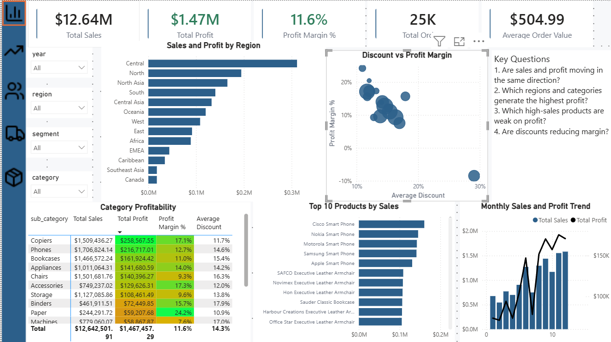
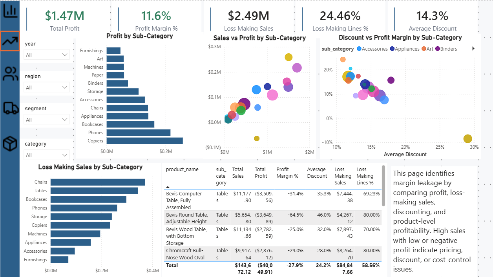
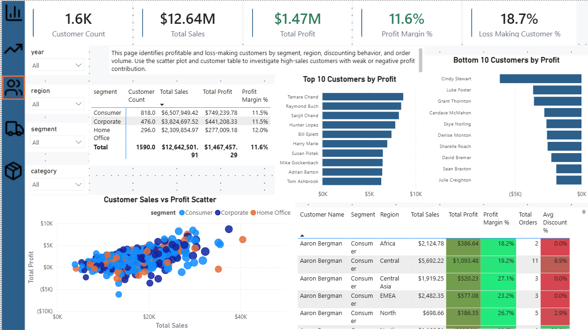
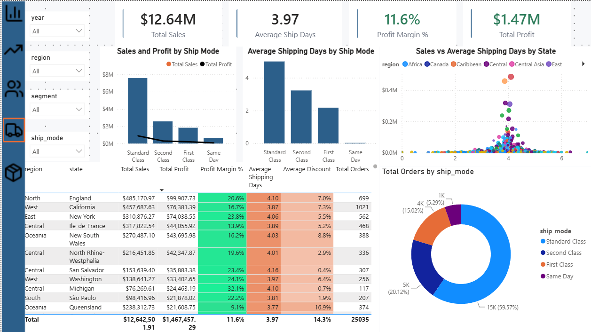
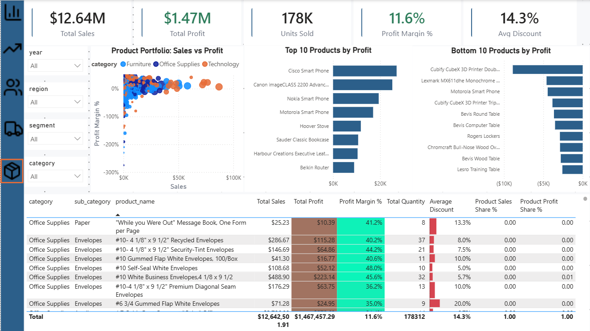

# Executive Sales & Profitability Dashboard

A portfolio-grade business intelligence solution analyzing sales performance and profitability across a global retail operation. Built end-to-end with **Python**, **SQL Server**, and **Power BI** on a star-schema data model.

> **Core narrative:** Sales volume alone tells you nothing about business health. This dashboard exposes *where revenue is profitable and where margin quietly leaks away* — surfacing that **24.5% of all order lines lose money**, draining roughly **$920K** in profit that top-line sales figures completely hide.


📄 [View the full report (PDF)](powerbi/GlobalSuperstore.pdf)
---

## Business Problem

Executives can see revenue growing, but growth isn't the same as health. The questions this dashboard answers:

- Are sales and profit moving in the same direction?
- Which regions, categories, customers, and products actually drive profit — not just revenue?
- Where are losses concentrated, and how big are they?
- Which high-sales products are secretly unprofitable?
- How much of the business is eroded by discounting?
- Where should management attention go first?

---

## Dataset

**Global Superstore** — a global retail transactional dataset spanning 2011–2014, covering orders across multiple markets, regions, product categories, and customer segments.

| Metric | Value |
|---|---|
| Total Sales | ~$12.64M |
| Total Profit | ~$1.47M |
| Profit Margin | 11.6% |
| Total Orders | ~25,035 |
| Average Order Value | ~$505 |
| Loss-Making Order Lines | 24.5% |

---

## Tools & Tech Stack

| Layer | Technology | Role |
|---|---|---|
| Data preparation | **Python** (pandas) | Cleaning, normalization, star-schema generation, data-quality checks |
| Storage / analytics | **SQL Server** | Loading, validation, and 12 reusable analytics views |
| Modeling & reporting | **Power BI Desktop** | Star-schema model, 58 DAX measures, 6 report pages |
| Calculation language | **DAX** | KPIs, ranking, time intelligence, portfolio segmentation |

---

## Data Preparation Process

`data_prep.py` transforms the raw single-table source into a clean star schema:

1. **Column normalization** — snake_case standardization across all fields.
2. **Date parsing** — consistent day-first parsing of order and ship dates.
3. **Cleaning** — string trimming, numeric coercion, removal of empty and duplicate rows.
4. **Dimension generation** — builds a continuous date calendar plus customer, product, geography, and ship-mode dimensions, each assigned surrogate keys.
5. **Fact assembly** — joins dimensions back to transactions, producing a fact table keyed entirely by surrogate keys plus the four core measures.

Supporting scripts (`conflict_summary.py`, `product_conflicts.py`) validate data quality — notably detecting `product_id` values mapping to multiple product names/categories before keys are assigned.

---
## Data Model (Star Schema)

```text
                  +------------+
                  |  dim.date  |
                  +------------+
                        |
+--------------+   +------------+   +-------------+
| dim.customer |---| fact.sales |---| dim.product |
+--------------+   +------------+   +-------------+
                    /          \
        +--------------+    +---------------+
        | dim.geography|    | dim.ship_mode |
        +--------------+    +---------------+
```


| Table | Rows | Columns | Notes |
|---|---|---|---|
| `fact.sales` | 51,290 | 12 | Surrogate keys + sales, quantity, discount, profit |
| `dim.date` | 1,468 | 8 | Continuous daily calendar with hierarchy fields |
| `dim.customer` | 1,590 | 4 | Customer + segment |
| `dim.product` | 10,768 | 6 | Includes `product_short_name` for clean chart labels |
| `dim.geography` | 3,847 | 6 | Country → region → state → city |
| `dim.ship_mode` | 4 | 2 | Shipping class |

**Design decisions:**
- Surrogate keys power relationships but are **hidden** from the Fields pane to keep the model clean and prevent misuse in visuals.
- SQL analytics views are kept as a *separate SQL-layer artifact* rather than collapsed into Power BI — preserving cross-filtering and dimensional integrity while still demonstrating SQL analytics capability.

---

## SQL Analytics Views (12 total)

A dedicated `analytics` schema of reusable, pre-aggregated views built on the star schema. Each uses `CREATE OR ALTER` for idempotent deployment and `NULLIF`-guarded division to avoid divide-by-zero. These serve as the SQL-layer portfolio artifact and a clean reporting surface independent of Power BI's model.

| # | View | Purpose |
|---|---|---|
| 1 | `vw_executive_kpis` | Single-row top-line KPIs: sales, profit, margin, orders, AOV |
| 2 | `vw_monthly_sales_profit` | Monthly sales/profit trend with a constructed month-start date |
| 3 | `vw_category_profitability` | Profitability by category and sub-category |
| 4 | `vw_product_profitability` | Per-product sales, profit, margin, and discount |
| 5 | `vw_region_performance` | Geographic performance down to city level |
| 6 | `vw_customer_profitability` | Per-customer profitability and average order value |
| 7 | `vw_segment_profitability` | Segment-level rollup with distinct customer counts |
| 8 | `vw_discount_impact` | Profitability bucketed into discount bands (No Discount → 50%+) |
| 9 | `vw_shipping_performance` | Ship-mode metrics with `DATEDIFF`-based average shipping days |
| 10 | `vw_product_pareto` | Cumulative sales window function flagging the top-80% contributors |
| 11 | `vw_loss_making_products` | Products filtered to negative total profit (`HAVING SUM(profit) < 0`) |
| 12 | `vw_sales_detail` | Wide denormalized fact-plus-dimensions table for ad-hoc exploration |

Techniques demonstrated: window functions (`SUM() OVER` with running totals for Pareto analysis), CTEs, conditional banding via `CASE`, date arithmetic, and aggregate filtering with `HAVING`. A validation block at the end of the script row-counts every view and spot-checks the KPI and detail outputs.

---

## DAX Measures (58 total)

The measure library spans core KPIs, profitability analysis, time intelligence, ranking, and portfolio segmentation. A representative selection:

**Core KPIs**
```dax
Total Sales = SUM ( 'fact.sales'[sales] )

Total Profit = SUM ( 'fact.sales'[profit] )

Profit Margin % = DIVIDE ( [Total Profit], [Total Sales] )

Average Order Value = DIVIDE ( [Total Sales], [Total Orders] )
```

**Profitability / margin-leakage analysis**
```dax
Loss Making Profit =
CALCULATE (
    [Total Profit],
    FILTER ( 'fact.sales', 'fact.sales'[profit] < 0 )
)

Loss Making Lines % =
DIVIDE ( [Loss Making Order Lines], [Total Order Lines] )

Discounted Sales % =
DIVIDE ( [Discounted Sales], [Total Sales] )
```

**Time intelligence**
```dax
Sales YoY Change % =
DIVIDE ( [Sales YoY Change], [Sales Previous Year] )
```

**Portfolio segmentation** — classifies each product against median sales and margin:
```dax
Product Portfolio Segment =
VAR SalesValue  = [Total Sales]
VAR ProfitValue = [Total Profit]
VAR MarginValue = [Profit Margin %]
VAR MedianSales  =
    MEDIANX ( ALLSELECTED ( 'dim.product'[product_name] ), [Total Sales] )
VAR MedianMargin =
    MEDIANX ( ALLSELECTED ( 'dim.product'[product_name] ), [Profit Margin %] )
RETURN
SWITCH (
    TRUE (),
    ProfitValue < 0, "Loss Maker",
    SalesValue >= MedianSales && MarginValue >= MedianMargin, "Star Product",
    SalesValue >= MedianSales && MarginValue <  MedianMargin, "Revenue Trap",
    SalesValue <  MedianSales && MarginValue >= MedianMargin, "Niche Profitable",
    "Low Performer"
)
```

Other measure families include customer/product/region ranking, loss contribution and concentration metrics, per-customer and per-shipping-day efficiency measures, and discounted-vs-undiscounted profitability comparisons.

---

## Dashboard Pages

The report has **6 pages** with consistent navigation, KPI styling, and a unified color system.

1. **Executive Overview** — top-line KPIs, sales/profit trend, performance by region and category, and a discount-vs-margin view framed around four key executive questions.
2. **Profitability Deep Dive** — margin-leakage analysis: loss-making sales, sub-category profitability, and the product-level detail behind unprofitable lines.
3. **Customer Performance** — top/bottom customers by profit, segment contribution, and a sales-vs-profit scatter to spot high-revenue / low-profit customers.
4. **Shipping & Logistics Performance** — ship-mode mix, shipping-day analysis, and geographic delivery performance.
5. **Product Performance & Portfolio Analysis** — product ranking, portfolio segmentation (Star / Revenue Trap / Niche / Loss Maker), and high-sales / low-profit detection.

## Dashboard Preview

### Profitability Deep Dive


### Customer Performance


### Shipping & Logistics Performance


### Product Performance & Portfolio Analysis

---

## Key Insights

- **Margin leakage is concentrated, not spread evenly** — a minority of products and sub-categories (notably certain Tables and Furniture lines) drive disproportionate losses, with some posting deeply negative margins.
- **High sales ≠ high profit** — several top-revenue products contribute little or negative profit, often tied to heavy discounting.
- **Discounting correlates with margin erosion** — the discount-vs-margin relationship shows profitability falling sharply as average discount climbs.
- **~24.5% of order lines lose money**, representing the central management-action opportunity.

---

## Skills Demonstrated

- Python data preparation, cleaning, and data-quality validation
- SQL Server loading, validation, and analytics view design (window functions, CTEs, aggregate filtering)
- Dimensional (star-schema) data modeling with surrogate keys
- Advanced DAX: time intelligence, ranking, dynamic segmentation
- Executive dashboard design and visual UX consistency
- Translating raw transactions into actionable business narrative

---

## Repository Structure

```text
Executive-Sales-Profitability-Dashboard/
├── README.md
├── scripts/
│   ├── data_prep.py
│   ├── conflict_summary.py
│   └── product_conflicts.py
├── sql/
│   ├── 01_create_tables.sql
│   └── 02_create_analytics_views.sql
│  
├── powerbi/
│   └── GlobalSuperstore.pbix
└── screenshots/
    ├── <executive_overview.png>
    ├── <profitability_deep_dive.png>
    ├── <customer_performance.png>
    ├── <shipping_logistics.png>
    └── <product_portfolio.png>
```

---

## How to Reproduce

1. Place the source `Global Superstore.csv` in the project root.
2. Run `python scripts/data_prep.py -i "Global Superstore.csv" -o outputs` to generate the star-schema CSVs.
3. Load the CSVs into SQL Server, then run `sql/01_create_tables.sql` followed by `sql/02_create_analytics_views.sql`.
4. Open `powerbi/GlobalSuperstore.pbix` in Power BI Desktop and refresh.

---
